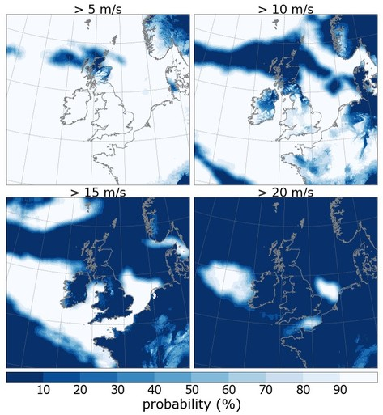
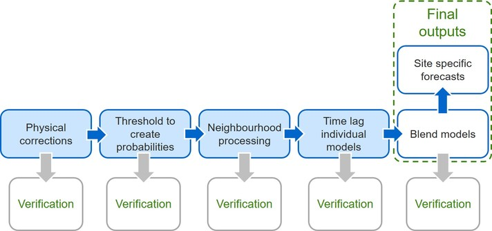

What is IMPROVER?
-----------------

IMPROVER: Integrated Model post-PROcessing and VERification

The IMPROVER repository provides a toolbox for post-processing ensemble weather forecasts. An example application of these tools is the combination of forecasts from different weather models into a blended forecast with improved forecast skill compared to any of the inputs. Additional techniques, such as spatial and temporal neighbourhooding, are available within the IMPROVER repository to further increase the spread of forecasts, capturing a greater range of possible future weather states. Functionality also exists to include older forecasts in the final blend, weighting them appropriately to capture the reduction in forecast skill at longer lead times. The end result is the consolidation of tens or hundreds of representations of a weather situation into an interrogable probabilistic output.

The IMPROVER repository also includes tools to improve the statistical properties of the forecast. For example, Ensemble Model Output Statistics and Reliability Calibration can be applied independently, or within a sequence of steps to improve forecast skill. Other tools are available to generate new diagnostics, such as the creation of a feels like temperature diagnostic, as well as understanding forecast characteristics by diagnosing whether the precipitation is showery or dynamic based upon the cloud "texture".

What is the IMPROVER strategy?
------------------------------

The `Met Office`_ in the UK is leading a project to create a probabilistic post-processing system for use with ensemble weather prediction models. The system is designed to extract the wealth of information provided by ensemble forecasts and present it in a format that is suitable for the production of automated weather forecasts, and for use by forecasters and the public. This project consists of a post-processing strategy, described in `Roberts et al., 2023`, and an open-source repository, which provides a toolbox of utilities for ensemble post-processing.

.. _Met Office: http://www.metoffice.gov.uk/

Within the Met Office, a new system built upon functionality in the IMPROVER repository is being used to provide a new probabilistic approach to post-processing forecasts. Gridded forecasts taken from multiple configurations of the Met Office's `Unified Model (UM)`_ first undergo physical corrections if necessary, before being converted into probabilities. The resulting probabilistic forecasts from each UM configuration are then blended to create seamless probabilistic outputs. These gridded probabilities aim to deliver both improved forecast information at each grid square and at geographical (“spot”) locations.

.. _Unified Model (UM): https://www.metoffice.gov.uk/research/approach/modelling-systems/unified-model/index

Key principles of the IMPROVER strategy are:

  1. A separate processing chain for each variable (e.g. temperature, rain rate) which operates on a  grid with location-specific information extracted at the end.
  2. A fully probabilistic system that allows for time-lagging and blending between models/ensembles and provides seamless probabilistic forecasts that exploits the benefits of each of the models used.
  3. The ability to provide outputs to enable automated forecasts of “ordinary” weather for any required location as well as more granular information about the possibility of high-impact weather for constructing warnings and risk estimation.
  4. A modular software framework following modern professional software development practices.

An example wind speed forecast produced using tools in the open-source repository is shown below. Four fields are plotted at different wind speed thresholds that may be of interest to the user, each field shows the probability of exceeding the relevant threshold.

   Probability of exceeding wind speed thresholds

Structure of IMPROVER
---------------------

The IMPROVER repository is designed as a modular post-processing toolbox. Using the strategy outlined in `Roberts et al., 2023`, a final product can be created through the application of a sequence of processing steps, where the sequence can be readily modified to achieve different outcomes. The output of each step in the chain can be written out, allowing for verification against observations at each stage (using a suitable verification package, which is not part of IMPROVER). This enables the user to determine whether a given step in the chain is improving or harming the forecast quality.

Any given step in the processing can be applied using the included :ref:`command line interfaces (CLIs)<using ref>`. A complex system can be built by calling the CLIs in sequence. The simple schematic below gives an example processing chain.

.. _command line interfaces (CLIs): :ref:`using_improver`

   An example processing chain with IMPROVER

.. _using ref:

Using the IMPROVER repository
-----------------------------

IMPROVER can be installed using pip or conda with installation instructions available in the `README`. Additionally, the code can be used by cloning the `GitHub repository`_ and calling the command line interfaces (CLIs) from a linux/unix terminal or by importing the modules directly into Python.

.. _GitHub repository: https://github.com/metoppv/improver
.. _README: https://github.com/metoppv/improver/blob/master/README.md

.. code:: console

    git clone https://github.com/metoppv/improver.git <local directory>

The list of dependencies can be found in the `environment.yml`_ file.

.. _environment.yml: https://github.com/metoppv/improver/blob/master/environment.yml

Example use of a CLI
====================

Here we give a simple example of using an IMPROVER CLI to threshold data, moving into probability space. This CLI invocation is from the root directory of a local copy of IMPROVER.

.. code:: console

    bin/improver threshold input.nc --threshold-values 5,10,15,20 --threshold-units m/s --output output.nc

* threshold is the name of the CLI to be called. In cases where the name of the CLI has underscores these should be written as hyphens e.g. snow_fraction would be written as snow-fraction.
* input.nc is a netCDF file containing a forecast diagnostic data cube, e.g. wind speeds across an x-y grid at a given time.
* for each threshold specified (5, 10, 15, 20 m/s) a new x-y grid of data will be created. Each point in the grid will contain a 0 if the input wind speed at that point was below the threshold, or 1 if it was above the threshold.
* the threshold units specifies the units of the provided thresholds (m/s) and these will be converted to match the units of the original cube before thresholding the input cube.
* output.nc will be a new netCDF file containing the resulting data cube with an additional leading dimension that corresponds to the given thresholds (5, 10, 15, 20 m/s).

This simple example covers one step in a processing chain. Additional information about using any CLI can be found on the command line using `\-\-help` (or `-h`), e.g.:

.. code:: console

    bin/improver nbhood --help

The current list of CLIs can be `found here`_.

.. _found here: improver.cli.html

Sample data for testing CLIs
============================
The test data used for the acceptance tests within IMPROVER is available in an open-source repository on GitHub: https://github.com/metoppv/improver_test_data.
Using this test data, along with the acceptance tests within the improver repository, provides a good start for exploring the functionality available.

Publications & Presentations
----------------------------

Below are links to publicly accessible publications & presentations that relate to IMPROVER.

When citing IMPROVER, we recommend using the sources in the first two rows of the table below, which refer to the latest academic publication on IMPROVER and the latest release of the codebase respectively.

+---------------------------------------------------------------------------------------------+-----------------------------------+
| Title                                                                                       | Authors                           |
+=============================================================================================+===================================+
|`IMPROVER - The New Probabilistic Postprocessing System at the Met Office (BAMS 2023)`_      | Nigel Roberts et al.              |
+---------------------------------------------------------------------------------------------+-----------------------------------+
|`Archive of latest released version of IMPROVER (Zenodo)`_                                   | IMPROVER Collaborators            |
+---------------------------------------------------------------------------------------------+-----------------------------------+
|`A post-processing and verification strategy for the future (MOSAC 2015)`_                   | Nigel Roberts & Marion Mittermaier|
+---------------------------------------------------------------------------------------------+-----------------------------------+
|`IMPROVER - the new post processing and verification system (MOSAC 2019)`_                   | Nigel Roberts et al.              |
+---------------------------------------------------------------------------------------------+-----------------------------------+
|`Generating probabilistic forecasts from convection permitting ensembles`_                   | Nigel Roberts                     |
+---------------------------------------------------------------------------------------------+-----------------------------------+
|`Creating a probabilistic, multi-model post-processing system (IMPROVER) at the Met Office`_ | Gavin Evans                       |
+---------------------------------------------------------------------------------------------+-----------------------------------+
|`Topographic neighbourhood processing`_                                                      | Fiona Rust                        |
+---------------------------------------------------------------------------------------------+-----------------------------------+
|`Improving the blend of multiple weather forecast sources by Reliability Calibration`_       | Fiona Rust et al.                 |
+---------------------------------------------------------------------------------------------+-----------------------------------+

.. _Roberts et al., 2023: https://doi.org/10.1175/BAMS-D-21-0273.1
.. _IMPROVER - The New Probabilistic Postprocessing System at the Met Office (BAMS 2023): https://doi.org/10.1175/BAMS-D-21-0273.1
.. _Archive of latest released version of IMPROVER (Zenodo): https://doi.org/10.5281/zenodo.8410114
.. _A post-processing and verification strategy for the future (MOSAC 2015): https://github.com/metoppv/improver/tree/master/doc/files/MOSAC_2015_20.19_Post-processing-verification.pdf
.. _IMPROVER - the new post processing and verification system (MOSAC 2019): https://github.com/metoppv/improver/tree/master/doc/files/MOSAC_23.9_Roberts_Paper_171218.pdf
.. _Generating probabilistic forecasts from convection permitting ensembles: https://presentations.copernicus.org/EMS2017-277_presentation.pdf
.. _Creating a probabilistic, multi-model post-processing system (IMPROVER) at the Met Office: https://presentations.copernicus.org/EMS2018-20_presentation.pdf
.. _Topographic neighbourhood processing: https://presentations.copernicus.org/EMS2018-70_presentation.pdf
.. _Improving the blend of multiple weather forecast sources by Reliability Calibration: https://doi.org/10.1002/met.2142

Contributing
------------

IMPROVER is freely available to use and we welcome contributions to code development, but please note that we are unable to provide support for use of the software at this time.

For details about contributing to IMPROVER, please refer to the `How to Contribute`_ page on GitHub.

.. _How to Contribute: https://github.com/metoppv/improver/blob/master/CONTRIBUTING.md
