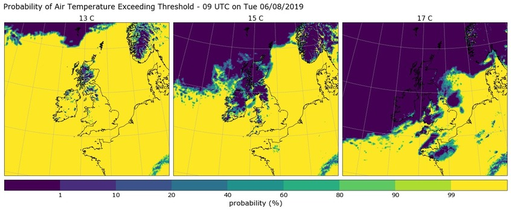

******************************************************
IMPROVER: Probabilistic meteorological post-processing
******************************************************

.. image:: https://img.shields.io/badge/License-BSD%203--Clause-blue.svg
   :target: https://opensource.org/licenses/BSD-3-Clause)
   :alt: License
.. image:: https://img.shields.io/badge/python-3.6-blue.svg
   :target: https://www.python.org/downloads/release/python-360/
   :alt: Python Version
.. image:: https://travis-ci.org/metoppv/improver.svg?branch=master
   :target: https://travis-ci.org/metoppv/improver
   :alt: Build Status

IMPROVER_ is a project being led by the `Met Office`_ in the UK to create a probabilistic post-processing system for ensemble weather prediction models. The aim is to extract the best possible probabilistic forecasts from multiple ensemble models, combining data from convection permitting and coarser resolution forecasts into a seamless blend.

.. _IMPROVER: https://github.com/metoppv/improver
.. _Met Office: http://www.metoffice.gov.uk/

